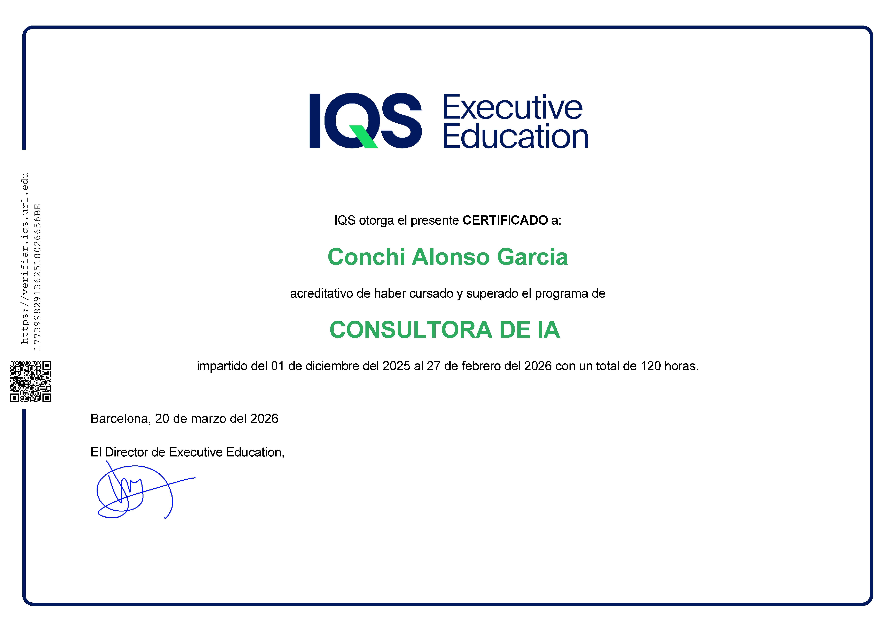
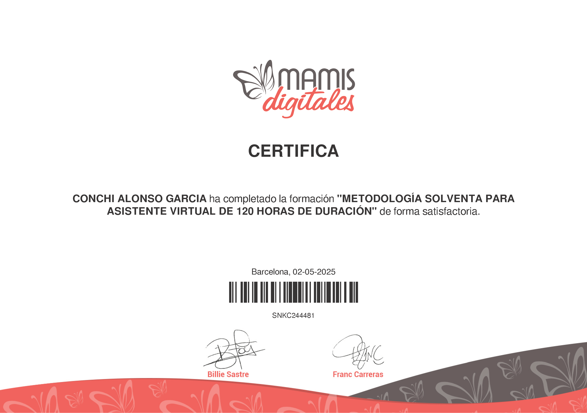

# 🎓 Mis Certificaciones y Diplomas

Esta sección contiene las acreditaciones oficiales que avalan mi formación técnica en IA, Ciberseguridad y Gestión Operativa.

---

### 🌟 Certificaciones Destacadas

<table>
  <tr>
    <td align="center">
       
      <b>Consultora de IA (120h)</b> <i>IQS Executive (2026)</i>
    </td>
    <td align="center">
       
      <b>Asistente Virtual Certificada</b> <i>Mamis Digitales (2025)</i>
    </td>
  </tr>
</table>

---

### 🛡️ Especializaciones en Ciberseguridad (Google)

He completado una serie de especializaciones técnicas enfocadas en la protección de activos digitales y gestión de riesgos:

| Certificado | Emisor | Enlace al archivo |
| :--- | :--- | :--- |
| **Gestión de Riesgos** | Google / Coursera | [Coursera S7NER7SYWR1H.png](./Coursera%20S7NER7SYWR1H.png) |
| **Seguridad de Redes** | Google / Coursera | [Coursera VGHVSJVPJ24.png](./Coursera%20VGHVSJVPJ24.png) |
| **Fundamentos de Ciberseguridad** | Google / Coursera | [Coursera BD7VEQGMNDM4.png](./Coursera%20BD7VEQGMNDM4.png) |
| **Detección y Respuesta** | Google / Coursera | [Coursera BZD2J7G87HKM.png](./Coursera%20BZD2J7G87HKM.png) |
| **Activos e Identidades** | Google / Coursera | [Coursera FYA2SNC56WD5.png](./Coursera%20FYA2SNC56WD5.png) |
| **Controles de Seguridad** | Google / Coursera | [Coursera KVY555AQQWRC.png](./Coursera%20KVY555AQQWRC.png) |
| **Linux y SQL en Ciberseguridad** | Google / Coursera | [Coursera YMWGHND6C8U8.png](./Coursera%20YMWGHND6C8U8.png) |

---

### 🤖 IA & Estrategia
* **Asistente Virtual con IA:** [certificado_iqs_asistente_virtual.png](./certificado_iqs_asistente_virtual.png)
* **Examen Magia para Consultora de IA:** [certificate-examen-magia-para-consultora-de-ia.png](./certificate-examen-magia-para-consultora-de-ia.png)

---
[⬅️ Volver al inicio](../README.md)
